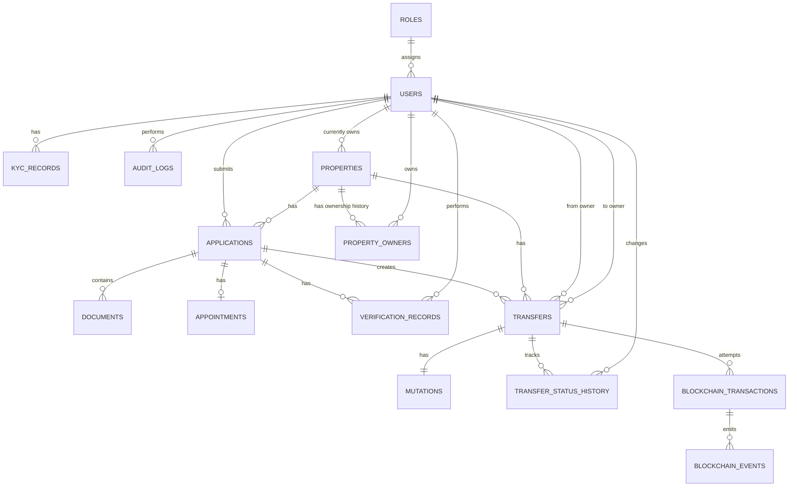

# B.H.U.M.I. — Database Design

**Document:** `DATABASE_DESIGN.md`  
**Version:** 1.0  
**Status:** MVP / Phase 1  
**Purpose:** Database reference for development

---

## 1. Purpose of This Document

This document defines the database design for the B.H.U.M.I. MVP.

It is intended to be the main database reference during development and describes:

- the database entities used in the MVP
- table schemas and columns
- primary keys and foreign keys
- relationships and cardinalities
- important constraints and invariants
- status values
- what information is intentionally kept out of the database
- the relationship between operational database data and blockchain data

This document focuses on **database design and implementation details**. Product requirements belong in the PRD, while broader system architecture belongs in `ARCHITECTURE.md`.

---

## 2. Database Technology

### Database

The MVP uses:

- **PostgreSQL** as the relational database
- **Prisma** as the ORM/data-access layer

The database is the operational data store for the application.

Sensitive documents and files are stored in secure off-chain storage. The PostgreSQL database stores references and cryptographic hashes rather than raw document contents.

Blockchain is not used as a replacement for PostgreSQL. Blockchain records provide the tamper-evident trust/audit layer, while PostgreSQL maintains the application's operational state.

---

## 3. MVP Database Scope

The MVP contains **15 database tables**.

| # | Table | Purpose |
|---|---|---|
| 1 | `roles` | Defines application roles |
| 2 | `users` | Stores users and their assigned role |
| 3 | `properties` | Stores property master information and current owner |
| 4 | `property_owners` | Stores property ownership history |
| 5 | `applications` | Stores citizen/property applications |
| 6 | `documents` | Stores document metadata and hashes |
| 7 | `appointments` | Stores application appointments |
| 8 | `kyc_records` | Stores KYC submission/verification records |
| 9 | `verification_records` | Stores verification actions performed on applications |
| 10 | `transfers` | Stores ownership transfer business records |
| 11 | `mutations` | Stores mutation records associated with transfers |
| 12 | `transfer_status_history` | Stores transfer status transitions |
| 13 | `blockchain_transactions` | Stores blockchain transaction attempts and their technical state |
| 14 | `blockchain_events` | Stores events emitted by blockchain transactions |
| 15 | `audit_logs` | Stores important user-performed actions |

### Explicitly removed from the MVP

The following are **not separate MVP database tables**:

- `user_roles` — removed because each user has exactly one role through `users.role_id`.
- `payments` — removed from the current MVP scope.
- `notifications` — removed from the current MVP scope.
- `registry_records` — removed because registry information should not be duplicated when it can be generated from existing records.
- analytics/reporting tables — not part of the current MVP schema.
- alerts tables — not part of the current MVP schema.

If these capabilities are added later, their database design must be reviewed against the PRD and architecture before implementation.

---

# 4. Entity Relationship Diagram

The following diagram shows the primary MVP database relationships.



### Important note about the diagram

The diagram uses the currently agreed MVP relationships. Some relationships that were not explicitly finalized as business requirements are marked in the detailed relationship section as **design assumptions/proposed relationships**, rather than silently treating them as requirements.

---

# 5. Relationship Summary

## 5.1 Role → User

**Cardinality:** `Role 1 : N User`

One role can be assigned to many users.

Each user has exactly one role.

```text
roles
  1
  |
  N
users
```

There is no `user_roles` table in the MVP.

---

## 5.2 User → KYC Record

**Cardinality:** `User 1 : N KYCRecord`

A user can have multiple KYC records because multiple submissions/history may exist.

Each KYC record belongs to exactly one user.

---

## 5.3 User → Application

**Cardinality:** `User 1 : N Application`

A user can submit multiple applications.

Each application belongs to one user.

---

## 5.4 User → Audit Log

**Cardinality:** `User 1 : N AuditLog`

A user can perform many auditable actions.

Each MVP audit log belongs to one user.

System-generated audit logs are outside the simplified MVP design.

---

## 5.5 User → Property (Current Owner)

**Cardinality:** `User 1 : N Property`

A user may currently own multiple properties.

Each property has exactly one current owner in the MVP.

The current owner is stored directly in:

```text
properties.current_owner_id
```

---

## 5.6 Property → Property Owner

**Cardinality:** `Property 1 : N PropertyOwner`

A property can have multiple ownership-history records over time.

Only one ownership record can be active at a time.

The active record is identified by:

```text
ownership_end IS NULL
```

---

## 5.7 User → Property Owner

**Cardinality:** `User 1 : N PropertyOwner`

A user can appear in ownership history for multiple properties.

---

## 5.8 Property → Application

**Cardinality:** `Property 1 : N Application`

A property can be involved in multiple applications over time.

Each application references one property.

---

## 5.9 Application → Document

**Cardinality:** `Application 1 : N Document`

An application can contain multiple documents.

Each document belongs to one application.

---

## 5.10 Application → Appointment

**Cardinality:** `Application 1 : 0..1 Appointment`

An application may have zero or one appointment in the MVP.

This is enforced by making:

```text
appointments.application_id UNIQUE
```

The MVP does not support appointment history/rescheduling as separate records.

---

## 5.11 Application → Verification Record

**Cardinality:** `Application 1 : N VerificationRecord`

An application can have multiple verification records.

Each verification record represents a verification action/type.

---

## 5.12 User → Verification Record

**Cardinality:** `User 1 : N VerificationRecord`

A user can perform many verification actions.

Each verification record identifies the user who performed the verification through:

```text
verification_records.verified_by
```

---

## 5.13 Application → Transfer

**Cardinality:** `Application 1 : N Transfer` — design assumption

A transfer is associated with an application.

The current MVP design uses `application_id` in `transfers`.

The exact business cardinality between applications and transfers should remain aligned with the approved workflow. The schema must not assume that every application type necessarily creates a transfer.

---

## 5.14 Property → Transfer

**Cardinality:** `Property 1 : N Transfer` — design assumption

A property can be involved in multiple ownership transfers over its lifetime.

Each transfer references the property involved.

---

## 5.15 User → Transfer (From Owner)

A transfer stores the owner before the transfer:

```text
transfers.from_owner_id
```

This references `users.id`.

---

## 5.16 User → Transfer (To Owner)

A transfer stores the intended new owner:

```text
transfers.to_owner_id
```

This also references `users.id`.

---

## 5.17 Transfer → Mutation

**Cardinality:** `Transfer 1 : 1 Mutation`

Each mutation corresponds to exactly one transfer.

This is implemented through:

```text
mutations.transfer_id UNIQUE
```

The mutation does not have a separate status in the MVP. The transfer status represents the business workflow state.

---

## 5.18 Transfer → Transfer Status History

**Cardinality:** `Transfer 1 : N TransferStatusHistory`

A transfer can have many status-history entries.

Example:

```text
PENDING
   ↓
APPROVED
   ↓
COMPLETED
```

The current state is stored in:

```text
transfers.status
```

The history is stored in:

```text
transfer_status_history
```

The latest history status should match the current `transfers.status`.

---

## 5.19 User → Transfer Status History

Each status-history entry records who changed the status through:

```text
transfer_status_history.changed_by
```

This references `users.id`.

---

## 5.20 Transfer → Blockchain Transaction

**Cardinality:** `Transfer 1 : N BlockchainTransaction`

A transfer may require multiple blockchain transaction attempts.

This is intentional.

Example:

```text
Transfer TR001

TX001 → FAILED
TX002 → CONFIRMED
```

This avoids overwriting failed transaction attempts.

---

## 5.21 Blockchain Transaction → Blockchain Event

**Cardinality:** `BlockchainTransaction 1 : N BlockchainEvent`

One blockchain transaction can emit multiple events.

Events are linked through:

```text
blockchain_events.transaction_id
```

For example, a transaction may emit an `OwnershipTransferred` event.

---

# 6. Detailed Table Schemas

## 6.1 `roles`

### Purpose

Stores the roles available in the B.H.U.M.I. application.

### Schema

```text
roles
----------------
id
name
created_at
```

### Columns

| Column | Type/Concept | Constraints |
|---|---|---|
| `id` | Primary key | PK, NOT NULL |
| `name` | Role name | NOT NULL, UNIQUE |
| `created_at` | Timestamp | NOT NULL |

### MVP role values

```text
CITIZEN
LOCAL_AUTHORITY
REGISTRAR
GOVERNMENT_HQ
ADMIN
```

---

# 6.2 `users`

### Purpose

Stores application users.

### Schema

```text
users
----------------------
id
role_id
name
email
phone
address
created_at
updated_at
```

### Columns

| Column | Type/Concept | Constraints |
|---|---|---|
| `id` | Primary key | PK, NOT NULL |
| `role_id` | FK → `roles.id` | NOT NULL |
| `name` | User name | NOT NULL |
| `email` | Email | NULLABLE, UNIQUE when provided |
| `phone` | Phone number | NOT NULL, UNIQUE |
| `address` | Address | Simple MVP field |
| `created_at` | Timestamp | NOT NULL |
| `updated_at` | Timestamp | NOT NULL |

### Important rule

There is **no `user_roles` table**.

A user has exactly one role:

```text
users.role_id → roles.id
```

---

# 6.3 `properties`

### Purpose

Stores the master record for a property.

### Schema

```text
properties
-------------------------
property_id
khasra_number
current_owner_id
location
metadata
status
created_at
updated_at
```

### Columns

| Column | Type/Concept | Constraints |
|---|---|---|
| `property_id` | Business identifier | PK, NOT NULL |
| `khasra_number` | Khasra identifier | NOT NULL |
| `current_owner_id` | FK → `users.id` | NOT NULL |
| `location` | Location | MVP field |
| `metadata` | Flexible property metadata | JSON/JSONB |
| `status` | Property state | NOT NULL |
| `created_at` | Timestamp | NOT NULL |
| `updated_at` | Timestamp | NOT NULL |

### Important rules

`property_id` is both:

- the business identifier
- the primary key

No separate internal `id` column is used.

Every property must have exactly one current owner in the MVP.

The current owner is represented by:

```text
properties.current_owner_id
```

This should remain consistent with the active row in `property_owners`.

---

# 6.4 `property_owners`

### Purpose

Stores property ownership history.

### Schema

```text
property_owners
-------------------------
id
property_id
user_id
ownership_start
ownership_end
created_at
```

### Columns

| Column | Type/Concept | Constraints |
|---|---|---|
| `id` | Primary key | PK, NOT NULL |
| `property_id` | FK → `properties.property_id` | NOT NULL |
| `user_id` | FK → `users.id` | NOT NULL |
| `ownership_start` | Timestamp | NOT NULL |
| `ownership_end` | Timestamp | NULLABLE |
| `created_at` | Timestamp | NOT NULL |

### Ownership rule

```text
ownership_end IS NULL
```

means that the ownership record is currently active.

Only one active ownership record should exist for a property.

---

# 6.5 `applications`

### Purpose

Stores applications submitted for properties.

### Schema

```text
applications
--------------------------------
application_id
user_id
property_id
application_type
status
created_at
updated_at
```

### Columns

| Column | Type/Concept | Constraints |
|---|---|---|
| `application_id` | Primary key | PK, NOT NULL |
| `user_id` | FK → `users.id` | NOT NULL |
| `property_id` | FK → `properties.property_id` | NOT NULL |
| `application_type` | Application type | NOT NULL |
| `status` | Workflow status | NOT NULL |
| `created_at` | Timestamp | NOT NULL |
| `updated_at` | Timestamp | NOT NULL |

### Application types

```text
REGISTRATION
TRANSFER
MUTATION
```

### Application statuses

```text
PENDING_VERIFICATION
APPROVED
REJECTED
RESUBMISSION
REGISTRY_PROCESSING
COMPLETED
```

---

# 6.6 `documents`

### Purpose

Stores metadata about documents submitted with applications.

The actual document file is stored in secure off-chain storage.

### Schema

```text
documents
--------------------------------
document_id
application_id
document_type
file_name
storage_reference
file_hash
created_at
updated_at
```

### Columns

| Column | Type/Concept | Constraints |
|---|---|---|
| `document_id` | Primary key | PK, NOT NULL |
| `application_id` | FK → `applications.application_id` | NOT NULL |
| `document_type` | Document category | NOT NULL |
| `file_name` | Original file name | NOT NULL |
| `storage_reference` | Secure storage reference | NOT NULL |
| `file_hash` | SHA-256 hash | NOT NULL |
| `created_at` | Timestamp | NOT NULL |
| `updated_at` | Timestamp | NOT NULL |

### Important rules

- Raw document files are not stored in PostgreSQL.
- `storage_reference` points to secure off-chain storage.
- `file_hash` is the SHA-256 hash of the exact file bytes.
- Hashing is an integrity mechanism; it is not encryption.
- The exact allowed `document_type` values are still to be finalized.
- A separate document approval/status field has not been finalized and should not be added without a requirement. Verification is represented through `verification_records`.

---

# 6.7 `appointments`

### Purpose

Stores the appointment associated with an application.

### Schema

```text
appointments
--------------------------------
appointment_id
application_id
appointment_date
status
created_at
updated_at
```

### Columns

| Column | Type/Concept | Constraints |
|---|---|---|
| `appointment_id` | Primary key | PK, NOT NULL |
| `application_id` | FK → `applications.application_id` | NOT NULL, UNIQUE |
| `appointment_date` | Date | NOT NULL |
| `status` | Appointment status | NOT NULL |
| `created_at` | Timestamp | NOT NULL |
| `updated_at` | Timestamp | NOT NULL |

### Status values

```text
SCHEDULED
COMPLETED
CANCELLED
```

### Relationship

```text
Application 1 : 0..1 Appointment
```

The unique `application_id` prevents multiple appointment records for the same application in the MVP.

---

# 6.8 `kyc_records`

### Purpose

Stores KYC submissions and their verification state.

### Schema

```text
kyc_records
--------------------------------
kyc_id
user_id
document_reference
status
verified_at
created_at
updated_at
```

### Columns

| Column | Type/Concept | Constraints |
|---|---|---|
| `kyc_id` | Primary key | PK, NOT NULL |
| `user_id` | FK → `users.id` | NOT NULL |
| `document_reference` | Off-chain KYC document reference | NOT NULL |
| `status` | KYC status | NOT NULL |
| `verified_at` | Verification timestamp | NULLABLE |
| `created_at` | Timestamp | NOT NULL |
| `updated_at` | Timestamp | NOT NULL |

### Status values

```text
PENDING
VERIFIED
REJECTED
```

A user can have multiple KYC records.

The system should be able to identify the current valid/verified KYC record.

---

# 6.9 `verification_records`

### Purpose

Stores verification actions performed on applications.

### Schema

```text
verification_records
--------------------------------
verification_id
application_id
verified_by
verification_type
remarks
verified_at
created_at
updated_at
```

### Columns

| Column | Type/Concept | Constraints |
|---|---|---|
| `verification_id` | Primary key | PK, NOT NULL |
| `application_id` | FK → `applications.application_id` | NOT NULL |
| `verified_by` | FK → `users.id` | NOT NULL |
| `verification_type` | Verification category | NOT NULL |
| `remarks` | Notes | NULLABLE |
| `verified_at` | Timestamp | NOT NULL |
| `created_at` | Timestamp | NOT NULL |
| `updated_at` | Timestamp | NOT NULL |

### Verification types

```text
KYC
DOCUMENT
PROPERTY
OWNERSHIP
DUPLICATE_CLAIM
```

### Important design decision

There is **no separate status field** in this table.

The application workflow status represents the overall application state. `remarks` can explain a failed/rejected verification.

---

# 6.10 `transfers`

### Purpose

Stores ownership transfer business records.

### Schema

```text
transfers
--------------------------------
transfer_id
application_id
property_id
from_owner_id
to_owner_id
status
created_at
updated_at
```

### Columns

| Column | Type/Concept | Constraints |
|---|---|---|
| `transfer_id` | Primary key | PK, NOT NULL |
| `application_id` | FK → `applications.application_id` | NOT NULL |
| `property_id` | FK → `properties.property_id` | NOT NULL |
| `from_owner_id` | FK → `users.id` | NOT NULL |
| `to_owner_id` | FK → `users.id` | NOT NULL |
| `status` | Transfer status | NOT NULL |
| `created_at` | Timestamp | NOT NULL |
| `updated_at` | Timestamp | NOT NULL |

### Transfer statuses

```text
PENDING
APPROVED
REJECTED
COMPLETED
```

### Important distinction

Transfer status is a **business status**.

It is different from the technical status of a blockchain transaction.

Blockchain failures are represented in `blockchain_transactions`, not by adding `FAILED` to transfer status.

---

# 6.11 `mutations`

### Purpose

Stores the mutation record associated with an ownership transfer.

### Schema

```text
mutations
--------------------------------
mutation_id
transfer_id
created_at
updated_at
```

### Columns

| Column | Type/Concept | Constraints |
|---|---|---|
| `mutation_id` | Primary key | PK, NOT NULL |
| `transfer_id` | FK → `transfers.transfer_id` | NOT NULL, UNIQUE |
| `created_at` | Timestamp | NOT NULL |
| `updated_at` | Timestamp | NOT NULL |

### Relationship

```text
Transfer 1 : 1 Mutation
```

The unique constraint on `transfer_id` enforces the one-to-one relationship.

No separate mutation status is stored. The transfer's business status is sufficient for the MVP.

---

# 6.12 `transfer_status_history`

### Purpose

Stores the history of transfer status changes.

### Schema

```text
transfer_status_history
--------------------------------
history_id
transfer_id
status
changed_at
changed_by
```

### Columns

| Column | Type/Concept | Constraints |
|---|---|---|
| `history_id` | Primary key | PK, NOT NULL |
| `transfer_id` | FK → `transfers.transfer_id` | NOT NULL |
| `status` | Transfer status | NOT NULL |
| `changed_at` | Timestamp | NOT NULL |
| `changed_by` | FK → `users.id` | NOT NULL |

### Status values

```text
PENDING
APPROVED
REJECTED
COMPLETED
```

### Important invariant

The latest history entry should match:

```text
transfers.status
```

This table preserves the sequence of state transitions while `transfers.status` stores the current state.

---

# 6.13 `blockchain_transactions`

### Purpose

Stores blockchain transaction attempts related to a transfer.

### Schema

```text
blockchain_transactions
--------------------------------
transaction_id
transfer_id
tx_hash
status
submitted_at
confirmed_at
created_at
updated_at
```

### Columns

| Column | Type/Concept | Constraints |
|---|---|---|
| `transaction_id` | Primary key | PK, NOT NULL |
| `transfer_id` | FK → `transfers.transfer_id` | NOT NULL |
| `tx_hash` | Blockchain transaction hash | NULLABLE |
| `status` | Technical transaction state | NOT NULL |
| `submitted_at` | Timestamp | NULLABLE |
| `confirmed_at` | Timestamp | NULLABLE |
| `created_at` | Timestamp | NOT NULL |
| `updated_at` | Timestamp | NOT NULL |

### Technical statuses

```text
SUBMITTED
PENDING
CONFIRMED
FAILED
```

### Transaction retry model

Multiple transaction records are allowed for one transfer.

Example:

```text
Transfer TR001
      |
      +---- TX001 → FAILED
      |
      +---- TX002 → PENDING
      |
      +---- TX003 → CONFIRMED
```

### Important rule

A successful submitted blockchain transaction should have a transaction hash.

`contract_address` and `chain_id` are not stored in this MVP table. They are treated as configuration rather than per-transaction database data.

---

# 6.14 `blockchain_events`

### Purpose

Stores blockchain events emitted by transactions.

### Schema

```text
blockchain_events
--------------------------------
event_id
transaction_id
event_type
log_index
event_data
occurred_at
created_at
```

### Columns

| Column | Type/Concept | Constraints |
|---|---|---|
| `event_id` | Primary key | PK, NOT NULL |
| `transaction_id` | FK → `blockchain_transactions.transaction_id` | NOT NULL |
| `event_type` | Event name/type | NOT NULL |
| `log_index` | Blockchain log index | NOT NULL |
| `event_data` | Event payload | JSON/JSONB |
| `occurred_at` | Blockchain event timestamp | NOT NULL |
| `created_at` | Database insertion timestamp | NOT NULL |

### Idempotency constraint

Use:

```text
UNIQUE(transaction_id, log_index)
```

This prevents the same blockchain event from being stored twice for the same transaction.

### Example event

```text
event_type:
OwnershipTransferred

event_data:
{
  "propertyId": "...",
  "fromOwner": "...",
  "toOwner": "..."
}
```

The exact MVP event types supported by the smart contract should remain aligned with `SMART_CONTRACT.md`.

---

# 6.15 `audit_logs`

### Purpose

Stores important user-performed actions for auditability.

### Schema

```text
audit_logs
--------------------------------
audit_id
user_id
action
entity_type
entity_id
created_at
```

### Columns

| Column | Type/Concept | Constraints |
|---|---|---|
| `audit_id` | Primary key | PK, NOT NULL |
| `user_id` | FK → `users.id` | NOT NULL |
| `action` | Action performed | NOT NULL |
| `entity_type` | Type of affected entity | NOT NULL |
| `entity_id` | ID of affected entity | NOT NULL |
| `created_at` | Timestamp | NOT NULL |

### Example

```text
audit_id:    101
user_id:     25
action:      APPROVE_TRANSFER
entity_type: TRANSFER
entity_id:   TR045
created_at:  2026-09-27 14:30
```

This means user 25 approved transfer TR045.

### Scope decision

The MVP keeps audit logs simple.

It does not add:

- IP address
- device information
- request headers
- large JSON metadata
- system-generated audit records

unless a later approved requirement requires them.

---

# 7. Important Database Invariants

These are rules the application/database must preserve.

## 7.1 One role per user

Every user has exactly one role.

```text
users.role_id IS NOT NULL
```

No `user_roles` junction table exists in the MVP.

---

## 7.2 Every property has one current owner

```text
properties.current_owner_id IS NOT NULL
```

The current owner should agree with the active ownership-history record.

---

## 7.3 One active ownership record per property

For each property:

```text
ownership_end IS NULL
```

should exist for only one `property_owners` record.

This should be enforced with an appropriate PostgreSQL constraint/index.

---

## 7.4 One appointment per application

```text
appointments.application_id UNIQUE
```

Therefore:

```text
Application 1 : 0..1 Appointment
```

---

## 7.5 One mutation per transfer

```text
mutations.transfer_id UNIQUE
```

Therefore:

```text
Transfer 1 : 1 Mutation
```

---

## 7.6 Transfer status and history must agree

The latest:

```text
transfer_status_history.status
```

should match:

```text
transfers.status
```

---

## 7.7 Blockchain events must be idempotent

Use:

```text
UNIQUE(transaction_id, log_index)
```

so duplicate event delivery does not create duplicate records.

---

## 7.8 Sensitive documents stay off-chain

The database stores:

```text
storage_reference
file_hash
```

not the raw document bytes.

No sensitive personal data should be placed on the blockchain unless explicitly approved.

---

# 8. State and Status Ownership

Different tables represent different kinds of state. Do not mix them.

| Table | State type |
|---|---|
| `applications` | Application/business workflow state |
| `appointments` | Appointment state |
| `kyc_records` | KYC verification state |
| `transfers` | Ownership-transfer business state |
| `transfer_status_history` | Historical transfer state transitions |
| `blockchain_transactions` | Technical blockchain transaction state |
| `properties` | Current property state |

For example:

```text
Transfer status:
PENDING → APPROVED → COMPLETED

Blockchain transaction:
SUBMITTED → PENDING → CONFIRMED
```

A blockchain transaction being `CONFIRMED` does not automatically mean that the transfer should skip the required business workflow stages.

---

# 9. Data Ownership: PostgreSQL vs Blockchain vs Secure Storage

## PostgreSQL

PostgreSQL is responsible for operational application data such as:

- users
- roles
- properties
- ownership projections/history
- applications
- documents metadata
- KYC records
- verification records
- transfers
- mutations
- appointments
- blockchain transaction tracking
- blockchain event records
- audit logs

## Secure off-chain storage

Secure storage contains sensitive/raw files such as:

- submitted documents
- KYC documents
- generated e-Registry documents where applicable

PostgreSQL stores references to these files.

## Blockchain

The blockchain acts as the tamper-evident trust/audit layer.

It can contain approved property/ownership information and cryptographic hashes according to the smart-contract design.

Raw PDFs and sensitive personal information should not be placed on-chain.

---

# 10. e-Registry Handling

There is **no `registry_records` table in the MVP**.

The reason is to avoid duplicating information already available through:

```text
properties
property_owners
applications
transfers
blockchain_transactions
documents
```

The e-Registry should be generated from the relevant existing records after the required workflow is completed.

This follows the MVP database principle:

> Do not create a separate table merely to repeat information that already has an authoritative source.

---

# 11. Data Flow Through the Database

A simplified registration/transfer flow is:

```text
User
  |
  v
Application
  |
  +---- Documents
  |
  +---- Appointment
  |
  +---- KYC / Verification
  |
  v
Transfer
  |
  +---- Transfer Status History
  |
  +---- Mutation
  |
  v
Blockchain Transaction
  |
  v
Blockchain Event
  |
  v
PostgreSQL ownership/state synchronization
  |
  v
Property + Property Owner History
```

Important actions are additionally recorded in:

```text
Audit Logs
```

---

# 12. Example: Ownership Transfer

Suppose property `P001` currently belongs to user `U100`.

A transfer to user `U200` occurs.

### Before

```text
properties
P001 → current_owner_id = U100

property_owners
P001 | U100 | ownership_start | NULL
```

### Transfer created

```text
transfers
TR001
property_id   = P001
from_owner_id = U100
to_owner_id   = U200
status        = PENDING
```

### Status approved

```text
transfers
TR001 → APPROVED
```

and:

```text
transfer_status_history
TR001 | PENDING  | ...
TR001 | APPROVED | ...
```

### Blockchain transaction

```text
blockchain_transactions

TX001 | TR001 | 0xabc... | CONFIRMED
```

### Blockchain event

```text
blockchain_events

EV001
TX001
OwnershipTransferred
log_index = 0
```

### Final PostgreSQL state

```text
properties
P001 → current_owner_id = U200
```

and ownership history becomes:

```text
property_owners

P001 | U100 | start | end
P001 | U200 | start | NULL
```

The exact transaction/event synchronization must follow the blockchain workflow and idempotency rules defined in the architecture and implementation rules.

---

# 13. Database Design Principles for Development

Developers working on the database should follow these principles:

1. **Do not create duplicate tables for the same data.**
2. **Do not duplicate information merely because another feature displays it.**
3. **Use foreign keys to represent relationships.**
4. **Use unique constraints where a business relationship requires uniqueness.**
5. **Use migrations for schema changes.**
6. **Do not modify the database structure without checking the approved requirements/design.**
7. **Keep sensitive files off-chain and outside the relational database when secure storage is required.**
8. **Store SHA-256 hashes for document integrity where required.**
9. **Keep business statuses separate from technical blockchain transaction statuses.**
10. **Preserve important state changes through history/audit records where defined.**
11. **Do not silently add new tables, fields, relationships, or technologies.**
12. **Use Prisma as the approved database access layer for the MVP.**

---

# 14. Items Still Requiring Explicit Finalization

The following details have not been fully finalized and should not be invented during implementation:

### Property status values

The architecture describes property states including:

```text
Pending
Verified
Active
Frozen
Disputed
```

The exact MVP state machine should be confirmed before implementing the enum/constraint.

### Document types

`documents.document_type` is required, but the complete allowed value list has not yet been finalized.

### Exact blockchain event types

The architecture identifies events such as:

```text
PropertyRegistered
OwnershipTransferred
PropertyFrozen
PropertyUnfrozen
PropertyDisputed
PropertyDisputeResolved
```

The exact subset required for the MVP should be aligned with `SMART_CONTRACT.md`.

### Current verified KYC enforcement

The schema allows multiple KYC records. The exact database mechanism for ensuring/identifying the current valid verified record should be finalized during Prisma/PostgreSQL implementation.

### Transfer cardinality

The database contains `application_id` and `property_id` in `transfers`. The exact business cardinality between an application and transfer should remain aligned with the approved workflow.

These items are intentionally left explicit rather than silently inventing requirements.

---

# 15. Prisma Implementation Notes

The database should be implemented through Prisma migrations.

Recommended development flow:

```text
DATABASE_DESIGN.md
       |
       v
Prisma schema
       |
       v
Migration
       |
       v
PostgreSQL
       |
       v
Prisma Client
       |
       v
Backend services/repositories
```

Before changing a table:

1. Check whether the change is required by the approved design.
2. Check relationships and foreign keys affected.
3. Update `schema.prisma`.
4. Create a migration.
5. Review the generated migration.
6. Apply it to the development database.
7. Test affected backend behavior.

Do not manually alter the database in a way that bypasses the migration history.

---

# 16. Final MVP Database Structure

```text
ROLES
  │
  └── USERS
       │
       ├── KYC_RECORDS
       ├── APPLICATIONS
       │     ├── DOCUMENTS
       │     ├── APPOINTMENTS
       │     ├── VERIFICATION_RECORDS
       │     └── TRANSFERS
       │            ├── MUTATIONS
       │            ├── TRANSFER_STATUS_HISTORY
       │            └── BLOCKCHAIN_TRANSACTIONS
       │                    └── BLOCKCHAIN_EVENTS
       │
       ├── PROPERTY_OWNERS
       └── AUDIT_LOGS

PROPERTIES
  ├── current_owner_id → USERS
  ├── PROPERTY_OWNERS
  ├── APPLICATIONS
  └── TRANSFERS
```

The database therefore contains **15 MVP tables** and deliberately avoids separate tables for data that can already be represented by existing entities.

---

## 17. Change Control

Any proposed database change should be checked against:

- `PRD.md`
- `ARCHITECTURE.md`
- `RULES.md`
- `WORKFLOWS.md`
- this `DATABASE_DESIGN.md`

If a proposed change introduces:

- a new table
- a new relationship
- a new state
- a new database technology
- sensitive on-chain data
- a change to an existing blockchain/database boundary

it should be reviewed before implementation.

The goal is to keep the MVP database **small, normalized, understandable, and aligned with the approved architecture*.